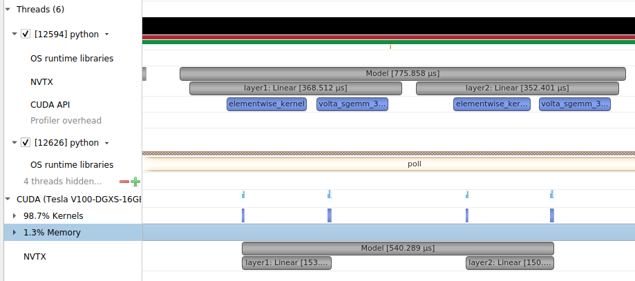
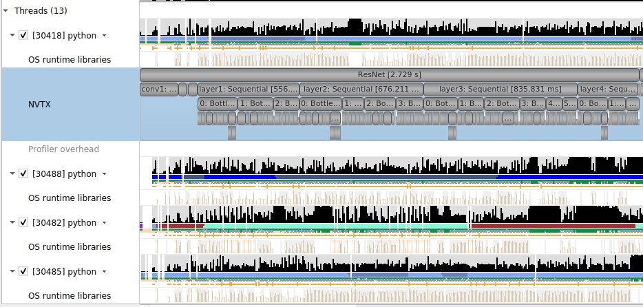

# Install

```
pip install autonvtx
```

# Usage

Write your model as usual and `autonvtx(model)` to your model:

```python
import torch
import autonvtx

class Model(torch.nn.Module):
    def __init__(self):
        super().__init__()
        self.layer1 = torch.nn.Linear(5, 5)
        self.layer2 = torch.nn.Linear(5, 5)
    def forward(self, x):
        x = self.layer1(x)
        x = self.layer2(x)
        return x

m = Model().cuda()
autonvtx(m)
input_ = torch.randn(1024, 5, device='cuda')

torch.cuda.profiler.start()
for _ in range(10):
    output = m(input_)
torch.cuda.profiler.stop()
```

The screenshot for this would be:



It also works with existing models:

```python
import torch
import torchvision
import autonvtx

m = torchvision.models.resnet50()
autonvtx(m)
input_ = torch.randn(10, 3, 224, 224)

torch.cuda.profiler.start()
for _ in range(10):
    output = m(input_)
torch.cuda.profiler.stop()
```

The screenshot for this would be:


